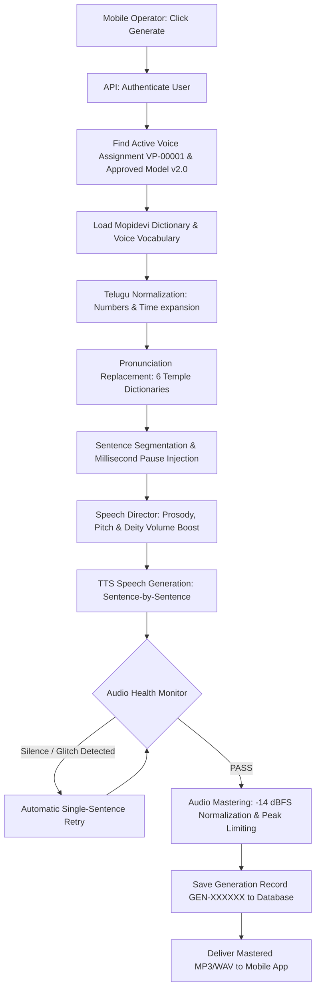

# 🛕 Mopidevi Temple AI Voice System — Master Architecture & Complete Plan From Zero

- **Live 24/7 Cloud Application**: [https://mopidevi-voice-app.onrender.com](https://mopidevi-voice-app.onrender.com)
- **GitHub Repository**: [https://github.com/rambabu5588/mopidevi-voice-app](https://github.com/rambabu5588/mopidevi-voice-app)
- **Free Cloud Hosting Guide**: [`FREE_HOSTING_GUIDE.md`](file:///e:/AI%20Clone/FREE_HOSTING_GUIDE.md)
- **Mobile Application Guide**: [`mobile_app/README.md`](file:///e:/AI%20Clone/mobile_app/README.md)

---

## 🏛️ Core System Philosophy

> **"The mobile application should be extremely simple. The backend should do the complicated work automatically."**

The admin creates/controls users and manages training. The backend automatically creates IDs (`USR-`, `AUTH-`, `PROF-`, `AUD-`, `DS-`, `VP-`, `VM-`, `GEN-`), extracts Telugu pronunciation requirements, trains the voice embeddings, versions models, auto-evaluates benchmarks, assigns voices to operators, manages templates, checks audio health, and performs auto-retries.

---

## 📱 1. Overall System Architecture

```
                    MOBILE APPLICATION
                            │
             ┌──────────────┴──────────────┐
             │                             │
        NORMAL USER                      ADMIN
             │                             │
       Generate Voice                Manage System
             │                             │
             └──────────────┬──────────────┘
                            │
                       REST / HTTPS
                            │
                            ▼
                 ┌────────────────────┐
                 │      BACKEND       │
                 │                    │
                 │ 1. Authentication  │
                 │ 2. User Management │
                 │ 3. Voice Manager   │
                 │ 4. Training Engine │
                 │ 5. Assignment Eng. │
                 │ 6. Pronunciation   │
                 │ 7. Template Engine │
                 │ 8. TTS Engine      │
                 │ 9. Quality Engine  │
                 │ 10. Audio Engine   │
                 │ 11. History Engine │
                 │ 12. Permissions    │
                 └──────────┬─────────┘
                            │
                            ▼
                   DATABASE (SQLite)
                            │
                            ▼
              LOCAL FILE STORAGE (media_storage/)
```

---

## 📲 2. First Screen of Mobile App (Dual Login)

When the application opens, users see a simple, clean landing screen with **no registration option for normal users**:

```
┌───────────────────────────────────────┐
│                                       │
│          🛕 MOPIDEVI TEMPLE           │
│           AI VOICE SYSTEM             │
│                                       │
│       [ 👤 NORMAL USER LOGIN ]        │
│                                       │
│       [ 🛡️ ADMIN LOGIN ]              │
│                                       │
└───────────────────────────────────────┘
```
- **Normal Users**: Accounts are strictly provisioned by Admin. No self-registration.
- **Admin**: Has full access to manage users, voice datasets, training sessions, and system configuration.

---

## 👥 3. Admin Creates a User & Automatic ID Generation

Admin enters **only the Person's Name** (no personal details, no mobile/email required):
- **Name**: `Sri Venkateswara Rao` (or `Operator Ramesh`)

The backend automatically creates all linked identifiers:
- **User ID**: `USR-00001`
- **Authentication ID**: `AUTH-00001`
- **Profile ID**: `PROF-00001`
- **Role**: `Operator` (or customized by Admin)
- **Status**: `Active`

---

## 🎙️ 4. User Records Voice (1/100 Sentence Reader)

After the account is created, the user logs in:
```
NORMAL USER
Welcome, Sri Venkateswara Rao
Voice Setup ──▶ [ Start Voice Recording ]
```

The app displays required training sentences one by one:
```
TRAINING 1 / 100
Please read:
"మోపిదేవి క్షేత్రానికి భక్తులందరికీ సాదర స్వాగతం."

[ 🎙 RECORD ]    [ 🔄 RETAKE ]    [ 🟢 ACCEPT ]
```

---

## 🆔 5. Backend Automatically Creates Audio IDs

The user never enters an Audio ID. Upon uploading each recording, the backend automatically generates:
- **Audio ID**: `AUD-000001`, `AUD-000002`, ...
- **User Link**: `USR-00001`
- **Training Sentence Link**: `TRN-000001`
- **Language**: `Telugu`
- **Quality Status**: `VALID` / `REJECTED`

---

## 🔍 6. Automatic Audio Quality Verification

Every raw recording is verified automatically before training:

```
Audio Clip Uploaded
        │
        ▼
Speech Detected? ──▶ [No] ──▶ ❌ REJECTED ("Please speak clearly into mic")
        │ [Yes]
        ▼
Excessive Noise? ──▶ [Yes] ──▶ ❌ REJECTED ("Noise floor exceeds -35dB")
        │ [No]
        ▼
Volume Level OK? ──▶ [No] ──▶ ❌ REJECTED ("Too soft or too loud")
        │ [Yes]
        ▼
Clipping Check?  ──▶ [Yes] ──▶ ❌ REJECTED ("Audio distorted/clipped")
        │ [No]
        ▼
Duration OK?     ──▶ [No] ──▶ ❌ REJECTED ("Duration out of range")
        │ [Yes]
        ▼
   ✓ ACCEPTED (Saved for Training)
```

---

## 📦 7. Automatic Dataset Builder (`DS-XXXXX`)

After sentences are recorded:
$$\text{AUD-001} + \text{AUD-002} + \dots + \text{AUD-100} \longrightarrow \text{Dataset ID: } \mathbf{DS-00001}$$

The backend automatically associates:
1. Audio File (`.wav`)
2. Exact Telugu Script Text
3. User Identifier (`USR-00001`)
4. Signal Quality Metrics (RMS, SNR, Pitch F0)
5. Phonetic Pronunciation Mapping

---

## 📖 8. Automatic Vocabulary Extraction

The backend parses all training sentences and automatically extracts vocabulary without requiring manual word assignment:

```
Training Text: "మోపిదేవి క్షేత్రానికి భక్తులందరికీ సాదర స్వాగతం"
                      │
                      ▼
Extracted Vocabulary: ["మోపిదేవి", "క్షేత్రానికి", "భక్తులందరికీ", "సాదర", "స్వాగతం"]
                      │
                      ▼
Voice Profile VP-00001 Vocabulary Built Automatically
```

---

## 🛕 9. Global Mopidevi Pronunciation Hierarchy

Pronunciation is resolved in a 3-tier hierarchy:

```
┌──────────────────────────────────────────────┐
│  Tier 1: Global Mopidevi Temple Dictionary   │
│  (మోపిదేవి, సుబ్రహ్మణ్య స్వామి, వల్లీ, etc.) │
└──────────────────────┬───────────────────────┘
                       │
┌──────────────────────▼───────────────────────┐
│  Tier 2: Voice-Specific Learned Vocabulary   │
│  (Acoustic profile VP-00001 pronunciations)  │
└──────────────────────┬───────────────────────┘
                       │
┌──────────────────────▼───────────────────────┐
│  Tier 3: User/Admin Pronunciation Overrides  │
└──────────────────────┬───────────────────────┘
                       │
                       ▼
            Final Pronunciation Rules
```

---

## 🧠 10. Automatic Pronunciation Learning & Review Queue

During training, backend compares:
$$\text{Expected Telugu Text} \quad \text{vs.} \quad \text{Speaker's Recorded Acoustic Realization}$$

- `✓ సుబ్రహ్మణ్య` — Correct (98% match)
- `✓ అభిషేకం` — Correct (96% match)
- `⚠ మోపిదేవి` — Flagged for review
- Flagged words are placed in an automated **Pronunciation Review Queue** for targeted snippet retraining.

---

## 🏗️ 11. Voice Training Pipeline (`VM-XXXXX-vX.X`)

```
Dataset (DS-00001) ──▶ Preprocessing & Normalization ──▶ 512-dim Neural Embeddings ──▶ Model v1.0 (TESTING)
```
- **Voice Profile**: `VP-00001`
- **Model**: `VM-00001`
- **Version**: `v1.0`
- **Initial Status**: `TESTING`

---

## 📊 12. Automatic Voice Evaluation & Benchmark Threshold

The backend synthesizes a standard benchmark test set:
- **Test Set Categories**: Temple words, General Telugu, Long/Short sentences, Numbers, Dates, Announcements, Emotional prosody.
- **Calculated Quality Metrics**:
  - Pronunciation Score: `92%`
  - Clarity Score: `95%`
  - Naturalness Score: `89%`
  - Consistency Score: `94%`
  - Temple Vocabulary: `93%`

$$\text{Overall Score} \ge 90\% \implies \mathbf{APPROVED} \quad | \quad \text{Overall Score} < 90\% \implies \mathbf{IMPROVEMENT\ REQUIRED}$$

---

## 🔁 13. Automatic Voice Improvement & Version Loop

```
Voice v1.0 ──▶ Evaluate ──▶ Targeted Snippet Fine-tuning ──▶ Voice v1.1 ──▶ Approve ──▶ Voice v2.0
```
- The system **never overwrites or destroys** previous stable versions.
- Older versions remain accessible for rollback if needed.

---

## 🔗 14. Automatic User → Voice Assignment

Once a voice is approved, the database creates the assignment automatically:

```sql
-- USER_VOICE_ASSIGNMENT
User ID:        USR-00001
Voice Profile:  VP-00001
Active Version: VM-00001-v2.0
Status:         ACTIVE
```
The operator never needs to remember or enter an Audio ID.

---

## ⚡ 15. Seamless Login Resolution

When `USR-00001` logs in:
$$\text{USR-00001} \xrightarrow{\text{Backend Lookup}} \text{VP-00001} \xrightarrow{\text{Active Model}} \text{VM-00001-v2.0}$$
Everything is resolved behind the scenes in `< 10ms`.

---

## 📝 16. Central Template Management

Pre-loaded global temple templates with embedded style & pause rules:
1. **దర్శనం (Darshan Queue)**: Default style `Announcement`, Speed `1.0x`
2. **స్వాగతం (Temple Welcome)**: Default style `Devotional`, Speed `0.95x`
3. **సర్పదోష నివారణ పూజ (Pooja Notice)**: Default style `Spiritual`, Speed `0.90x`
4. **తీర్థప్రసాదాలు (Prasadam Notice)**: Default style `Warm`, Speed `1.0x`
5. **ఉత్సవ ప్రకటన (Festival Announcement)**: Default style `Festival`, Speed `1.05x`
6. **ముఖ్యమైన సూచన (Important / Emergency Notice)**: Default style `Important`, Speed `1.0x`

---

## 📜 17. Automatic Generation History (`GEN-XXXXXX`)

Every generation is automatically recorded:
- **Generation ID**: `GEN-000092`
- **User ID**: `USR-00001`
- **Voice Profile**: `VP-00001`
- **Model Version**: `v2.0`
- **Template**: `DARSHAN`
- **Script**: `[Telugu Text]`
- **Timestamp & Audio URL**: `announcement_GEN-000092.mp3`

---

## 🔐 18. Role-Based Permissions (RBAC)

| Capability | Super Admin | Voice Manager | Operator | Viewer |
|---|:---:|:---:|:---:|:---:|
| Generate Announcements | ✅ | ✅ | ✅ | ❌ |
| Preview & Download Audio | ✅ | ✅ | ✅ | ✅ |
| View Own History | ✅ | ✅ | ✅ | ❌ |
| Record Voice Sessions | ✅ | ✅ | ❌ | ❌ |
| Train & Fine-Tune Models | ✅ | ✅ | ❌ | ❌ |
| Approve Voice Versions | ✅ | ✅ | ❌ | ❌ |
| Manage User Accounts | ✅ | ❌ | ❌ | ❌ |
| Modify Global Dictionaries | ✅ | ✅ | ❌ | ❌ |

---

## 🎯 19. Operator Workflow (Ultra-Simple)

```
[ LOGIN ] ──▶ [ SELECT TEMPLATE ] ──▶ [ ENTER DETAILS ] ──▶ [ GENERATE ] ──▶ [ PLAY / DOWNLOAD ]
```
Operators never see neural embeddings, epoch counts, loss curves, phoneme IDs, or audio paths.

---

## ⚡ 20. End-to-End Generation Pipeline (`POST /api/announcements/generate`)



---

## 🛡️ 21. Automatic Voice Health Monitor & Single-Sentence Retry

The generation engine continuously monitors audio quality in real-time:
- **Speech Detected**: Verified via RMS energy threshold ($>-40\text{ dBFS}$).
- **Silence Elimination**: Detects and trims unexpected silent gaps ($>800\text{ms}$).
- **Clipping Protection**: Guarantees zero digital distortion.
- **Auto-Retry**: If a specific sentence fails quality checks, only that sentence is regenerated automatically without failing the entire announcement.

---

## 🔄 22. Automatic Version Rollback Safeguard

If a newly trained model version fails benchmark checks:
$$\text{Model v2.3 (FAILED)} \xrightarrow{\text{Safeguard Triggered}} \text{Do NOT Activate} \implies \text{Keep Stable Model v2.2 ACTIVE}$$
Users are never exposed to untested or degraded voice versions.

---

## 📋 23. Summary of Six Automated Requirements

| Requirement | Automated Backend Mechanism |
|---|---|
| **1. Assign Audio IDs** | Automatically created upon receipt (`AUD-000001`, `AUD-000002`). |
| **2. Assign Pronunciation Requirements** | Automatic vocabulary extraction + 3-tier Mopidevi dictionary. |
| **3. Approve Voice Versions** | Automated benchmark test suite with threshold gating & rollback safeguard. |
| **4. Manage Templates** | Central template database with preset styles, emotions, and breathing pauses. |
| **5. View Generation History** | Every generation automatically logged (`GEN-000092`) with playback links. |
| **6. Manage Permissions** | Role-based permissions automatically assigned from user role. |

---

## 🏛️ 24. Master Directory Structure

```
e:\AI Clone/
├── backend/
│   ├── main.py                        # FastAPI endpoints & async pipeline
│   ├── database.py                    # SQLite schema, users, versions, jobs, assignments
│   └── mopidevi_app.db                # Production SQLite Database
├── mopidevi_voice/
│   ├── pronunciation/                 # 6 Telugu dictionaries & pronunciation engine
│   ├── text_processing/              # Telugu normalizer & sentence splitter
│   ├── speech_director/               # 6 delivery styles, emotions, deity emphasis
│   ├── voice_clone/
│   │   ├── analyzer.py                # Pre-upload verification & quality badges
│   │   ├── deep_clone.py              # 512-dim neural speaker embeddings (XTTS v2)
│   │   ├── trainer.py                 # Vocabulary extraction & adaptive training
│   │   ├── evaluator.py               # Benchmark evaluation & quality score calculation
│   │   └── version_manager.py         # Version creation (v1.0 -> v2.0) & approval
│   ├── pipeline/
│   │   └── generate.py                # Sentence-by-sentence TTS & auto-retry loop
│   └── audio/
│       ├── validator.py               # Audio health monitor & silence detector
│       └── masterer.py                # -14 dBFS normalization & MP3 mastering
├── media_storage/
│   ├── recordings/                    # Raw uploaded audio samples (AUD-XXXXXX)
│   ├── voice_models/                  # Neural speaker embeddings (VP-XXXXXX)
│   └── outputs/                       # Mastered announcement audios (GEN-XXXXXX)
├── mobile_app/                        # Native Flutter Cross-Platform App
│   ├── lib/
│   │   ├── main.dart                  # Dual Login Screen (Normal User vs Admin)
│   │   ├── services/api_service.dart  # REST API Client
│   │   ├── screens/home_screen.dart   # Simple Operator Announcement Generator
│   │   ├── screens/training_screen.dart # 1/100 Sentence Training Session
│   │   └── screens/settings_screen.dart # Account & Server URL settings
│   └── pubspec.yaml
├── Dockerfile                         # Cloud deployment container definition
├── render.yaml                        # Free 24/7 Render.com cloud deployment config
└── FREE_HOSTING_GUIDE.md              # Cloud deployment guide
```